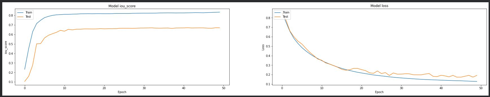
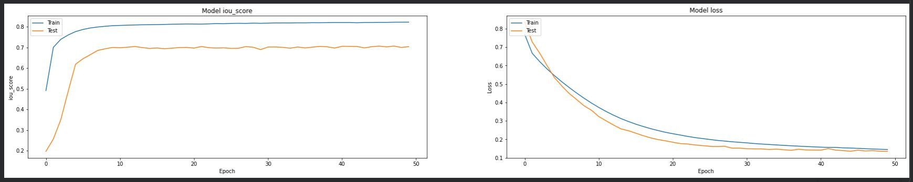
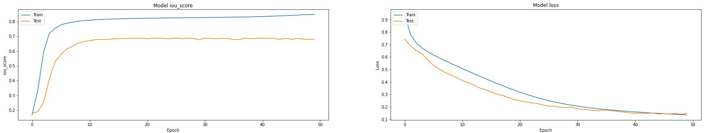
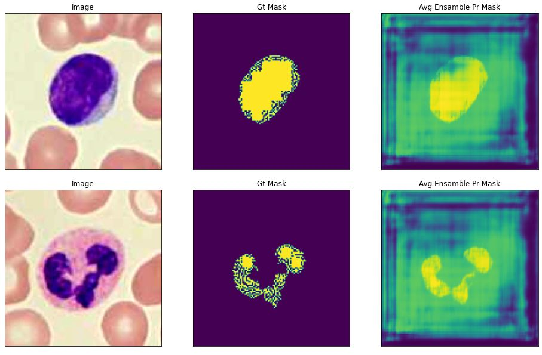

# Leukaemia Cell Segmentation Using U-Net Ensemble Models

> Automated segmentation of blast cells from peripheral blood smear images using an ensemble of U-Net models with ResNet34, VGG19 and InceptionV3 encoder backbones trained on the ALL_IDB2 dataset.

---

## Table of Contents

- [Project Overview](#project-overview)
- [Results](#results)
- [Learning Curves](#learning-curves)
- [Dataset](#dataset)
- [Project Structure](#project-structure)
- [Requirements](#requirements)
- [How to Run](#how-to-run)
- [Reproducing Results](#reproducing-results)
- [Sample Predictions](#sample-predictions)
- [Limitations](#limitations)
- [References](#references)

---

## Project Overview

This project tackles the problem of automatically identifying and segmenting leukaemia blast cells in microscopic blood smear images. Manual analysis by haematologists is time-consuming and inconsistent across observers, so the goal here is to build a deep learning pipeline that can do this reliably and at scale.

Three separate U-Net segmentation models were trained, each with a different pretrained encoder backbone:

- **U-Net + ResNet34**
- **U-Net + VGG19**
- **U-Net + InceptionV3**

Their predictions were then combined using an average ensemble strategy to produce a final, more stable segmentation output.

The project was built in Python using Keras and TensorFlow 1.x, and all training was done on Google Colab with GPU acceleration.

---

## Results

The table below shows the final evaluation metrics for each model and the ensemble, all measured on the held-out test set after 50 epochs of training.

| Model | Loss | Accuracy | IoU Score | F1 Score | Dice Coefficient |
|---|---|---|---|---|---|
| U-Net + ResNet34 | 0.1916 | 97.28% | 0.6703 | 0.7916 | 0.9887 |
| U-Net + VGG19 | 0.1344 | 97.79% | 0.7037 | 0.8161 | 0.9907 |
| U-Net + InceptionV3 | 0.1483 | 97.52% | 0.6794 | 0.7980 | 0.9898 |
| **Average Ensemble** | **0.1581** | **97.53%** | **0.6845** | **0.8019** | **0.9897** |

**Key finding:** VGG19 was the strongest individual model across all meaningful metrics. The ensemble did not surpass VGG19 outright but produced more consistent and stable predictions across the test set.

> Note: Accuracy appears high across all models because of pixel-level class imbalance (background pixels dominate each image). IoU and F1 Score are the more meaningful metrics for evaluating segmentation quality.

---

## Learning Curves

### ResNet34

<!-- Add your ResNet34 IoU and Loss plots here -->
<!-- Example:  -->


Training IoU reached approximately 0.82 while test IoU plateaued around 0.68, indicating some overfitting. The train and test loss curves converge but with a noticeable gap in the later epochs.

---

### VGG19

<!-- Add your VGG19 IoU and Loss plots here -->
<!-- Example:  -->


The smoothest training behaviour of the three models. Test IoU settles at around 0.70 with minimal noise, and the train and test loss curves track closely together throughout all 50 epochs, suggesting good generalisation with the least overfitting.

---

### InceptionV3

<!-- Add your InceptionV3 IoU and Loss plots here -->
<!-- Example:  -->


An interesting pattern here: the test loss drops faster than the training loss in the early epochs before the two converge. Test IoU plateaus at approximately 0.68, similar to ResNet34.

---

### Sample Predictions

<!-- Add predicted mask visualisations here showing ground truth vs model output -->
<!-- Example:  -->


Each row shows the original blood smear image, the ground truth mask and the predicted segmentation mask from the ensemble model.

---

## Dataset

This project uses the **ALL_IDB2** dataset (Acute Lymphoblastic Leukaemia Image Database, version 2), compiled by researchers at the Universita degli Studi di Milano.

**Dataset link:** [https://homes.di.unimi.it/scotti/all/](https://homes.di.unimi.it/scotti/all/)

**Dataset details:**

| Property | Value |
|---|---|
| Total images | 260 |
| Image type | Individual cell crops (TIFF format) |
| Labels | Binary masks (cell vs background) |
| Training split | 188 images (72.3%) |
| Test split | 72 images (27.7%) |
| Input size used | 128 x 128 x 3 |

Each image in ALL_IDB2 is a cropped image of a single cell from a peripheral blood smear, accompanied by a binary ground truth mask marking the nucleus and cytoplasm of the blast cell. Unlike ALL_IDB1, which contains full field-of-view microscope images, ALL_IDB2 is pre-cropped and therefore well-suited for cell-level segmentation experiments.

**How to download:**

1. Visit the dataset page linked above and request access, or search for ALL_IDB2 on Kaggle where community-hosted versions are available.
2. Download the image zip (ALL_IDB2_IMAGES) and mask zip (ALL_IDB2_MASK) separately.
3. Upload both zip files to your Google Drive before running the notebook.

---

## Project Structure

```
├── ensemble_UNET_Multiback_bone.ipynb               # Main training notebook (run this)
├── README.md                    # This file
├── assets/                      # Folder for images used in this README
│   ├── resnet34_curves.jpg      # ResNet34 learning curve plot
│   ├── vgg19_curves.jpg         # VGG19 learning curve plot
│   ├── inceptionv3_curves.jpg   # InceptionV3 learning curve plot
│   └── sample_predictions.jpg   # Example predicted masks
└── models/                      # Saved model weights (if you export them)
    ├── resnet34_model.h5
    ├── vgg19_model.h5
    └── inceptionv3_model.h5

## Requirements

This project was built on **Google Colab** using **TensorFlow 1.x**. It will not run correctly on TensorFlow 2.x without changes.

**Core dependencies:**

```
tensorflow==1.x  (use %tensorflow_version 1.x in Colab)
keras
segmentation-models
albumentations
opencv-python-headless==4.1.2.30
h5py==2.10.0
numpy
matplotlib
```

**Install commands used in the notebook:**

```bash
pip install h5py==2.10.0
pip install opencv-python-headless==4.1.2.30
pip install -U git+https://github.com/albu/albumentations --no-cache-dir
pip install segmentation-models
```

---

## How to Run

### Step 1: Set up Google Colab

Open the notebook in Google Colab. Make sure you switch the runtime to GPU before running:

```
Runtime > Change runtime type > Hardware accelerator > GPU
```

### Step 2: Mount Google Drive

Run the first cell to mount your Google Drive:

```python
from google.colab import drive
drive.mount('/content/drive')
```

### Step 3: Upload the dataset to Google Drive

Upload both zip files to your Google Drive. The notebook expects them at:

```
/content/drive/MyDrive/fiverr/blood/ALL_IDB2_IMAGES-20220317T045421Z-001.zip
/content/drive/MyDrive/fiverr/blood/ALL_IDB2_MASK-20220317T045641Z-001.zip
```

If you save them to a different folder, update these paths in the unzip cell:

```python
!unzip /content/drive/MyDrive/fiverr/blood/ALL_IDB2_IMAGES-20220317T045421Z-001.zip
!unzip /content/drive/MyDrive/fiverr/blood/ALL_IDB2_MASK-20220317T045641Z-001.zip
```

### Step 4: Switch to TensorFlow 1.x

The notebook requires TensorFlow 1.x. This cell must be run before any imports:

```python
%tensorflow_version 1.x
import tensorflow as tf
```

### Step 5: Install dependencies

Run the pip install cells at the top of the notebook in order. Do not skip h5py==2.10.0 as it is required for model saving compatibility.

### Step 6: Run all cells in order

Run the notebook from top to bottom. The cells will:

1. Set up the directory structure for train/test splits
2. Load and preprocess the dataset
3. Train ResNet34 U-Net for 50 epochs
4. Train VGG19 U-Net for 50 epochs
5. Train InceptionV3 U-Net for 50 epochs
6. Evaluate each model on the test set
7. Create the average ensemble and evaluate it
8. Plot learning curves for each model

---

## Reproducing Results

To reproduce the exact results reported in this project, follow these steps precisely:

**Data split:** The first 188 files (sorted alphabetically) go to training and the remaining 72 go to the test set. This is handled automatically by the notebook's shutil split cell.

**Training configuration:** All three models use identical settings:

| Setting | Value |
|---|---|
| Optimiser | Adam |
| Learning rate | 0.0001 |
| Batch size | 8 |
| Epochs | 50 |
| Loss | Dice Loss + Binary Focal Loss |
| Pretrained weights | ImageNet |
| Input size | 128 x 128 x 3 |

**Augmentation:** Augmentation was not applied in the reported runs. The Albumentations pipeline is included in the code but commented out. Leave it commented out to reproduce the same numbers.

**Ensemble:** The ensemble averages the raw probability outputs from all three models before thresholding. The weighted ensemble code contains a bug and should not be used to reproduce results.

**Expected test set results:**

| Model | IoU | F1 Score | Dice Coefficient |
|---|---|---|---|
| ResNet34 | 0.6703 | 0.7916 | 0.9887 |
| VGG19 | 0.7037 | 0.8161 | 0.9907 |
| InceptionV3 | 0.6794 | 0.7980 | 0.9898 |
| Ensemble | 0.6845 | 0.8019 | 0.9897 |

> Small variations in the last decimal places are normal due to GPU non-determinism. If you see significantly different numbers, check that TensorFlow 1.x is active and that the dataset split matches the one described above.

---

## Limitations

There are a few known issues and limitations with the current implementation:

**No augmentation:** The augmentation pipeline is in the code but was not used during training. Applying it would likely improve IoU scores by several percentage points.

**Weighted ensemble bug:** The weighted ensemble formula has a bracket error where division is applied only to the third model's predictions rather than the full sum. Use only the average ensemble until this is fixed.

**TensorFlow 1.x dependency:** The notebook requires TensorFlow 1.x which is no longer maintained. Migrating to TensorFlow 2.x or PyTorch would improve compatibility and access to newer tools.

**No cross-validation:** Results are from a single fixed train/test split and have not been validated across multiple splits.

**No explainability:** Grad-CAM or similar visualisation methods are not implemented. These would be valuable for understanding which image regions each model focuses on.

---

## References

He, K., Zhang, X., Ren, S. and Sun, J. (2016) Deep residual learning for image recognition. CVPR, pp. 770-778.

Labati, R.D., Piuri, V. and Scotti, F. (2011) ALL-IDB: The Acute Lymphoblastic Leukemia Image Database for Image Processing. ICIP, pp. 2045-2048.

Lin, T.Y., Goyal, P., Girshick, R., He, K. and Dollar, P. (2017) Focal loss for dense object detection. ICCV, pp. 2980-2988.

Ronneberger, O., Fischer, P. and Brox, T. (2015) U-Net: Convolutional networks for biomedical image segmentation. MICCAI, pp. 234-241.

Simonyan, K. and Zisserman, A. (2014) Very deep convolutional networks for large-scale image recognition. arXiv:1409.1556.

Szegedy, C., Vanhoucke, V., Ioffe, S., Shlens, J. and Wojna, Z. (2016) Rethinking the Inception architecture for computer vision. CVPR, pp. 2818-2826.

Yakubovskiy, P. (2019) Segmentation Models. GitHub. https://github.com/qubvel/segmentation_models

---

## Author

**Student ID:** 25026348  
**Programme:** Masters in Data Science and Artificial Intelligence  
**Module:** CSC-44112 Advanced Applications of AI and Machine Learning  
**Institution:** Keele University  
**Instructors:** Dr. Baidaa Al-Bander | Dr. Sangeeta
